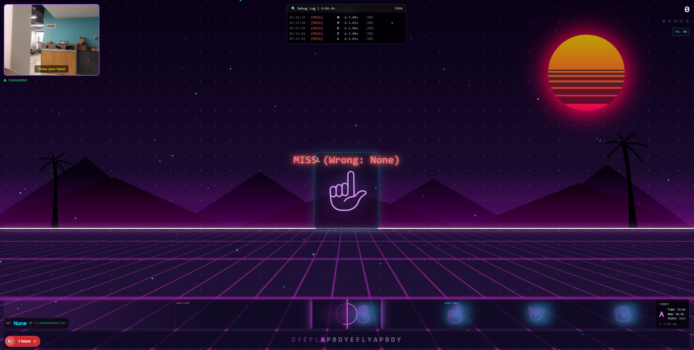
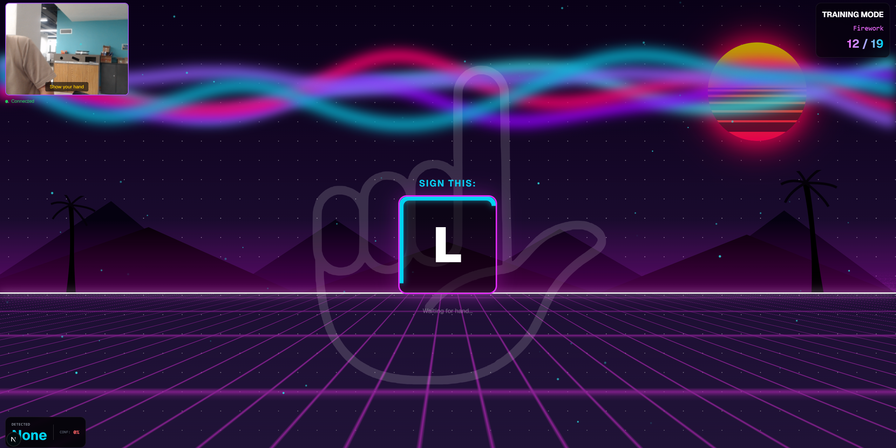
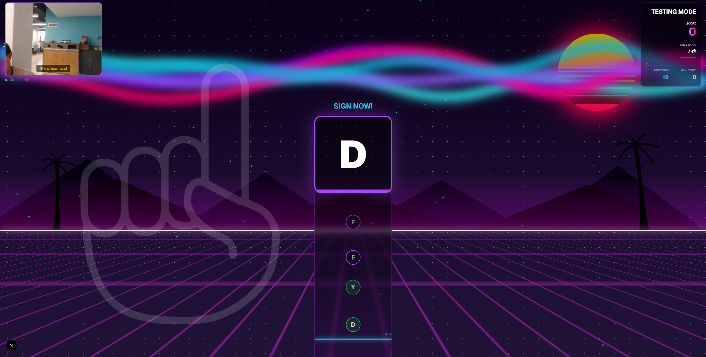
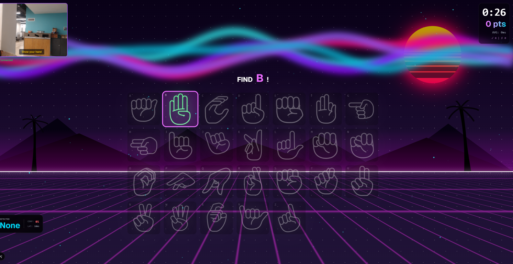

# 🤟 SignHero

**An interactive American Sign Language (ASL) learning game built with real-time AI hand sign recognition.**

Learn ASL fingerspelling through rhythm-based gameplay, practice modes, and arcade-style challenges—all powered by webcam-based machine learning.

---

## 📸 Screenshots & Demos

<!-- Add your GIFs and screenshots here! -->

| Feature | Preview |
|---------|----------|
| **JustDance Mode** |  |
| **Training Mode** |  |
| **SignHero Mode** |  |
| **Whack-A-Sign** |  |


---

## ✨ Features

### 🎮 Game Modes

| Mode | Description |
|------|-------------|
| **Just Dance Game** | A rhythm game where players sign along to beatmaps synced with music. JustDance-style note highway with real-time scoring, combos, and visual effects. |
| **Training Mode** | Guided practice where each sign is displayed one-at-a-time with visual hints and a 10-second auto-skip timer. Perfect for learning at your own pace. |
| **SignHero Mode** | A timed challenge to measure proficiency. Tracks Perfect/Good/Miss hits, accuracy, and max combo with detailed results. Like GuitarHero |
| **Whack-A-Sign** | An arcade-style reflex game. A grid of letters appears, and players must quickly sign or tap the highlighted target. Features streaks and celebrations. |

### 🤖 AI-Powered Sign Detection

- **Real-time webcam analysis** using MediaPipe hand tracking
- **MobileNetV2 CNN** for ASL letter classification (A-Z)
- **Confidence scoring** displayed per-prediction
- **Latency monitoring** to ensure responsive gameplay
- Predictions via local Python FastAPI server (~30-50ms latency)

### 💫 Visual Polish

- **Synthwave aesthetic** with neon grids, palm trees, and animated sun
- **Framer Motion animations** for smooth transitions
- **Particle effects** on successful hits (bursts, rays, confetti)
- **Screen flash & shake** feedback for hits and misses
- **Streak glow effects** on the note highway (Guitar Hero-style)
- **Floating score & success text** overlays

### 🎵 Audio

- **Background music** with mute toggle
- **Sound effects** for hits, misses, and streaks
- Audio context initialization on first user interaction

### 📊 Scoring & Metrics

- **Combo multipliers** for consecutive hits
- **Accuracy-based scoring** (timing affects points)
- **Streak milestones** with special celebrations
- **End-of-game stats** (accuracy %, max combo, hit breakdown)

---

## 🛠️ Tech Stack

| Category | Technology |
|----------|------------|
| **Framework** | [Next.js 15](https://nextjs.org/) (App Router, Turbopack) |
| **Language** | [TypeScript](https://www.typescriptlang.org/) |
| **UI** | [React 19](https://react.dev/), [Tailwind CSS 4](https://tailwindcss.com/) |
| **Animation** | [Framer Motion](https://www.framer.com/motion/) |
| **API Layer** | [tRPC](https://trpc.io/) with React Query |
| **Database** | [MongoDB](https://www.mongodb.com/) via [Prisma ORM](https://www.prisma.io/) |
| **File Storage** | [AWS S3](https://aws.amazon.com/s3/) (presigned URLs) |
| **AI/ML** | [PyTorch](https://pytorch.org/) (MobileNetV2), [MediaPipe](https://mediapipe.dev/) (hand tracking) |
| **Audio** | Web Audio API, [YouTubei.js](https://github.com/LuanRT/YouTube.js) for audio extraction |

---

## 📁 Project Structure

```
asl/
├── src/
│   ├── app/                    # Next.js App Router pages
│   │   ├── game/               # Game modes (song, training, testing)
│   │   ├── songselection/      # Song browsing carousel
│   │   ├── leaderboard/        # High scores
│   │   └── community/          # Community-created content
│   │
│   ├── components/
│   │   ├── game/               # Game canvas components
│   │   │   ├── GameCanvas.tsx           # Main rhythm game
│   │   │   ├── TrainingCanvas.tsx       # Practice mode
│   │   │   ├── TestingCanvas.tsx        # Timed challenge
│   │   │   ├── WhackAMoleCanvas.tsx     # Arcade mode
│   │   │   ├── NoteHighway.tsx          # Scrolling notes
│   │   │   ├── WebcamFeed.tsx           # Camera display
│   │   │   ├── SuccessBurst.tsx         # Hit effects
│   │   │   └── SynthwaveBackground.tsx  # Animated background
│   │   └── ui/                 # Reusable UI primitives
│   │
│   ├── hooks/                  # Custom React hooks
│   │   ├── useGameLoop.ts      # Main game logic
│   │   ├── useSignDetection.ts # AI prediction integration
│   │   ├── useWebcam.ts        # Camera capture
│   │   ├── useSoundEffects.ts  # Audio management
│   │   └── useVisualEffects.ts # Particle/effect triggers
│   │
│   ├── lib/                    # Utility modules
│   │   ├── beatmap.ts          # Beatmap types & demo data
│   │   ├── gameScoring.ts      # Scoring logic
│   │   ├── particleEngine.ts   # Canvas particle effects
│   │   ├── s3.ts               # AWS S3 integration
│   │   └── youtube.ts          # Audio extraction
│   │
│   ├── server/
│   │   └── api/                # tRPC routers
│   │       └── routers/        # song, leaderboard, etc.
│   │
│   └── trpc/                   # tRPC client setup
│
├── public/
│   ├── audio/                  # Sound effect files
│   └── fonts/                  # Custom typography
│
└── prisma/
    └── schema.prisma           # MongoDB schema
```

---

## 🚀 Getting Started

### Prerequisites

- **Node.js 20+**
- **pnpm** (recommended) or npm
- **MongoDB** instance (local or Atlas)
- **AWS S3** bucket (for audio/thumbnail storage)

### Installation

```bash
# Clone the repository
git clone https://github.com/MsMarion/ASL-Fun-Training.git
cd ASL-Fun-Training/asl

# Install dependencies
pnpm install

# Set up environment variables
cp .env.example .env
# Edit .env with your MongoDB URI, S3 credentials, etc.

# Generate Prisma client
pnpm db:generate

# Start development server
pnpm dev
```

The app will be available at `http://localhost:3000`.

### Environment Variables

| Variable | Description |
|----------|-------------|
| `DATABASE_URL` | MongoDB connection string |
| `AWS_ACCESS_KEY_ID` | AWS credentials for S3 |
| `AWS_SECRET_ACCESS_KEY` | AWS credentials for S3 |
| `AWS_S3_BUCKET_NAME` | S3 bucket name |
| `GOOGLE_AI_API_KEY` | Google Generative AI key (optional) |

---

## 🎯 How It Works

### Sign Detection Pipeline

1. **Webcam Capture**: `useWebcam` hook captures video frames at ~30fps
2. **Frame Processing**: Frames are sent to a detection model
3. **Prediction**: Model returns predicted letter + confidence score
4. **Game Logic**: `useGameLoop` compares prediction to current target note
5. **Feedback**: Visual/audio effects triggered based on hit quality

### Beatmap System

Beatmaps define the sequence and timing of signs:

```typescript
interface Beatmap {
  title: string;
  totalDuration: number; // seconds
  notes: BeatmapNote[];
}

interface BeatmapNote {
  letter: string;  // e.g., "A", "B", "C"
  time: number;    // seconds from start
}
```

---

## 📜 Scripts

| Command | Description |
|---------|-------------|
| `pnpm dev` | Start dev server with Turbopack |
| `pnpm build` | Production build |
| `pnpm start` | Start production server |
| `pnpm db:studio` | Open Prisma Studio |
| `pnpm lint` | Run ESLint |
| `pnpm typecheck` | TypeScript type checking |

---

## 🤝 Contributing

Contributions are welcome! Please open an issue or submit a pull request.

1. Fork the repository
2. Create a feature branch (`git checkout -b feature/amazing-feature`)
3. Commit your changes (`git commit -m 'Add amazing feature'`)
4. Push to the branch (`git push origin feature/amazing-feature`)
5. Open a Pull Request

---

## 📄 License

This project is for educational purposes.

---

## 🙏 Acknowledgments

- Built with the [T3 Stack](https://create.t3.gg/)
- Synthwave aesthetics inspired by retro gaming
- ASL fingerspelling charts for sign references
